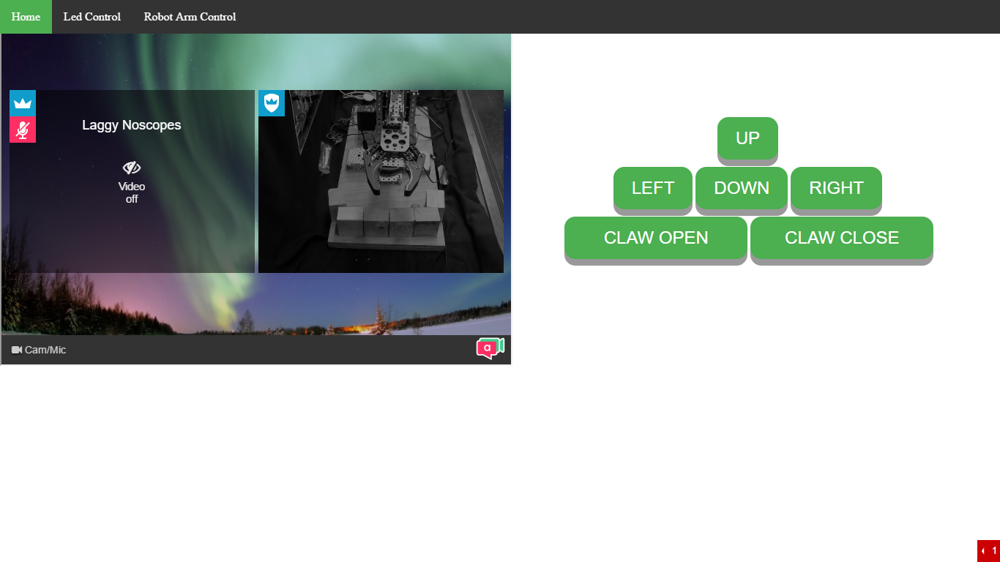

# Arduino Web interface
 
Information

**This project is the property of the Halton District School board and White Oaks Secondary School. Please give credit if you ever use this code for personal development. 
 
In this project, an application is created where a robot arm is controlled online at a remote location. 
 
To visit the website go to www.wossrobotics.ca/armcontrol.html .
 
If you are a first time user click on this link : https://appear.in/LED_Control
 
Make sure to block your webcam!

# Development Notes 
 
Anyone in the HDSB district school board can join this project for further developments!
 
Quick Pointers
- Our website has already been built which is available for viewing at wossrobotics.ca/armcontrol.html .
- Other projects such as the robot hand are currently in production and will be launched at the discretion of White Oaks Secondary School Computer Engineering Department. 

